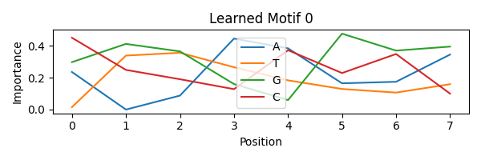
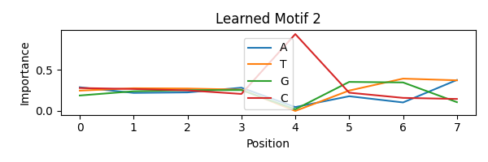

# 🧬 DNA Promoter Classification using CNN

This project focuses on **DNA sequence classification** to identify **human promoter regions** using a **Convolutional Neural Network (CNN)**.  
Along with prediction, the model is interpreted biologically by **visualizing learned DNA motifs**, making it suitable for genomics research and ML internships.

---

## 🎯 Project Objective

- Classify DNA sequences into:
  - **Promoter**
  - **Non-Promoter**
- Learn biologically meaningful **sequence motifs**
- Interpret CNN filters in a genomics context

---

## 🧠 Background

Promoters are DNA regions that control gene expression.  
They often contain **specific sequence motifs** (e.g., AT-rich regions) that can be learned automatically by deep learning models like CNNs.

---
## Motif Visualization & Interpretation 
🔬 Motif Visualization & Interpretation

CNN filters were visualized to understand what biological patterns the model learned.

🧩 Learned Motifs
 


 
🧠 Biological Interpretation

Strong A/T rich patterns observed

These motifs are consistent with known promoter regions

Indicates the CNN is learning biologically meaningful features, not random noise  

## 🗂️ Project Structure


```text
dna_promoter_classification/
│
├── src/
│   ├── load_data.py          # Dataset loading
│   ├── preprocess.py         # DNA encoding & preprocessing
│   ├── model.py              # CNN architecture
│   ├── train.py              # Model training
│   ├── evaluate.py           # Model evaluation
│   ├── motif_analysis.py     # Motif visualization
│   └── models/               # Saved trained models
│
├── Analysis_visualization/
│   ├── motif_learn0.png
│   ├── motif_learn1.png
│   └── motif_learn2.png
│
└── README.md

🧪 Dataset

Human promoter dataset

DNA alphabet: A, T, G, C

Binary labels:

1 → Promoter

0 → Non-Promoter

⚙️ Methodology
1️⃣ Preprocessing

Clean DNA sequences

Fixed-length normalization

One-hot encoding (A, T, G, C)

2️⃣ Model

Convolutional Neural Network (CNN)

Filters learn short DNA motifs

MaxPooling for motif selection

3️⃣ Training

Train / Validation / Test split

Best model saved automatically

📊 Results
Metric	Score
Accuracy	87%
Precision	0.87
Recall	0.87
F1-Score	0.87

Balanced performance across both classes.

🚀 How to Run
# Train model
python train.py

# Evaluate model
python evaluate.py

# Visualize motifs
python motif_analysis.py

✅ Project Status

✔️ Data preprocessing
✔️ Model training & evaluation
✔️ Motif visualization
✔️ Biological interpretation

Project completed and ready for research / internship applications.

👤 Author

Somveer Singh
B.Tech CSE | R.V INSTITUTE OF TECHNOLOGY BIJNOR

